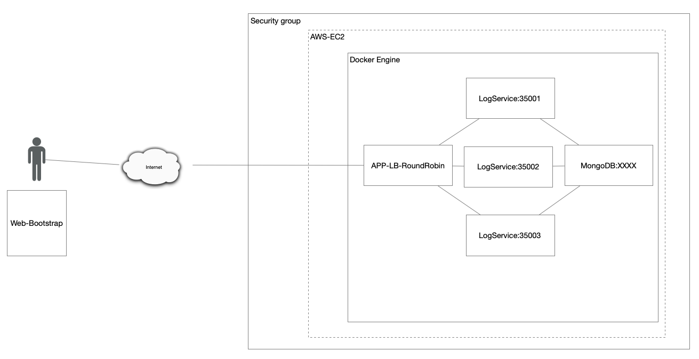

# Spark web application with mongoDB deployed in AWS
This repository includes code to deploy a basic Client-Server application to AWS, it is builded with Apache Spark, html, css, javascript and docker.

## Architecture

This Client-Server application uses an architecture that has 4 components all in docker containers, the components are:
- Front(APP-LB-RoundRobin):
it has an component for the visual client web part so the clients can perform POST request, this component performs RoundRobin load balancing algortihm so it can balance the client request on 3 diferent containers of the "Backend"
- Back(LogService):
This LogService performs the Persistence of the request from the client as the server.
- MongoDB:
Database for the POST request from the clients and GET request from the last 10 posted text of the clients

## Round Robin

Evidence of the Round Robin and project working

project listing only the last 10 items:


Round Robin working


## Docker build and run the app

You can deploy easily the web application with docker-compose using the following command (you'll need to be in the root path in order to execute it):
```
docker-compose up -d --scale log=3
```

if you only want to build the image is with the following command(you'll need to be in the dockerfile's paths in order to execute the command):
```
docker build -t <tagfortheimage> .
```